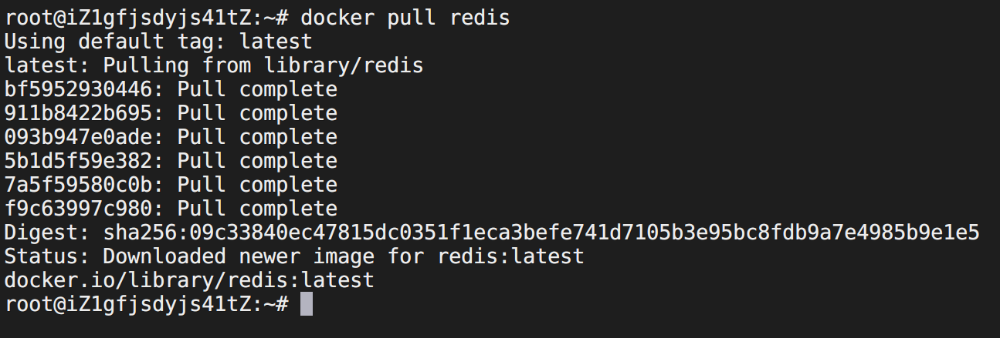
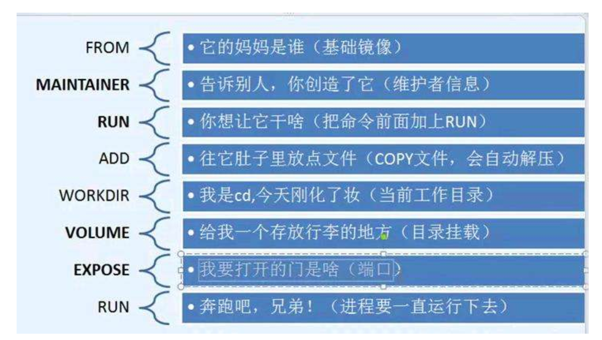

# Docker

**安装**

> **centos 安装文档**：[https://docs.docker.com/install/linux/docker-ce/centos/](https://docs.docker.com/install/linux/docker-ce/centos/)
>
> **Docker Hub**: [https://docs.docker.com/install/linux/docker-ce/centos/](https://docs.docker.com/install/linux/docker-ce/centos/)


## 常用命令

### 服务（service）重启

```bash
# 守护进程重启
$ sudo systemctl daemon-reload
# 重启docker服务
$ sudo systemctl restart docker
# 关闭docker
$ sudo systemctl stop docker

# service 方式
# 重启 docker 服务
$ sudo service docker restart
# 关闭 docker
$ sudo service docker stop

# 查看容器cpu状态
docker stats
```


### 镜像（images）常用命令

```bash
# 拉取镜像
docker pull [镜像名称:版本]
# 镜像列表
docker images
# 删除镜像
docker rmi [镜像名称:版本]
# 镜像操作记录
docker history [镜像名称]
# 
docker tag [镜像名称:版本][新镜像名称:新版本]
# 查看镜像详细
docker inspect [镜像名称:版本]
# 搜索镜像
docker search [关键字]
# 镜像登陆
docker login       				
```


### 镜像（images）补充命令

```bash
# 删除全部镜像
docker rmi -f $(docker images -aq)
```


### 容器（container）常用命令

```bash
# 容器列表(所有容器)
docker ps -a
# 查看所有(运行的)容器
docker ps
# 以 bash 命令进入容器内
docker exec -ti <container_id> bash
# 查看容器日志
docker logs 
# 启动容器 映射端口
docker run --name -d [容器名称] -p 8080:80 [镜像名称:版本]
# 删除容器
docker rm <container_id> 
# 停止容器
docker stop <container_id> 
# 开启容器
docker start <container_id> 
# 重启容器
docker restart <container_id> 
# 查看容器详情
docker inspect <container_id> 
# 容器提交为新的镜像	
docker commit [容器名称] my_image:v1.0  
```


### 容器（container）补充命令

```bash
# attach： 进入容器正在执行的终端，不会开启新的进程
docker attach <container_id>
# 查看容器最近的一个进程
docker top <container_id>
# 删除所有的容器
docker rm -f $(docker ps -aq)
# 强制停止容器
docker kill <container_id> 
# 拷贝容器内的文件到主机
docker cp <container_id>:<容器内的路径> <主机路径>
```


## 介绍

### 镜像

> Docker 镜像加载原理

Docker 的镜像实际上由一层一层的文件系统组成，这种层级的文件系统 UnionFS。

bootfs(boot file system)主要包含 bootloader 和 kernel, bootloader主要是引导加载 kernel, Linux 刚启动时会加载bootfs文件系统，在 Docker 镜像的最底层是 bootfs。这一层与我们典型的 Linux/Unix 系统是一样的，包含 boot 加载器和内核。当 boot 加载完成之后整个内核就都在内存中了，此时内存的使用权已由 bootfs 转交给内核，此时系统也会卸载bootfs。

rootfs (root file system)，在 bootfs 之上。包含的就是典型 Linux 系统中的 /dev, /proc, /bin,  /etc 等标准目录和文件。rootfs 就是各种不同的操作系统发行版，比如Ubuntu, Centos 等等。


对于一个精简的 OS ,rootfs 可以很小，只需要包含最基本的命令，工具和程序库就可以了，因为底层直接用 Host 的kernel，自己只需要提供 rootfs 就可以了。由此可见对于不同的 linux 发行版, bootfs 基本是一致的, rootfs 会有差别,因此不同的发行版可以公用 bootfs。

虚拟机是分钟级别，容器是秒级!


### 分层理解

> 分层的理解

我们可以去下载一个镜像，注意观察下载的日志输出，可以看到是一层一层的在下载!




思考:为什么 Docker 镜像要采用这种分层的结构呢?

最大的好处，我觉得莫过于是资源共享了!比如有多个镜像都从相同的 Base 镜像构建而来，那么宿主机只需在磁盘上保留一份 base 镜像，同时内存中也只需要加载一份 base 镜像，这样就可以为所有的容器服务了，而且镜像的每一层都可以被共享。

查看镜像分层的方式可以通过 `docker image inspect` 命令!


> 特点

Docker 镜像都是只读的，当容器启动时，一个新的可写层被加载到镜像的顶部!

这一层就是我们通常说的容器层，容器之下的都叫镜像层!


### commit 镜像

```bash
# commit 提交容器成为一个新的副本
docker commit 
# 命令和git原理类似
docker commit -m=<提交的描述信息> -a=<作者> <容器id> 目标镜像名:[TAG]
```


## 容器数据卷

### 什么是容器数据卷

**docker的理念回顾**

将应用和环境打包成一个镜像！

数据？如果数据都在容器中，那么我们容器删除，数据就会丢失!需求：数据可以持久化

MySQL，容器删了，删库跑路！需求：MySQL 数据可以存储在本地！

容器之间可以有一个数据共享的技术！Docker 容器中产生的数据，同步到本地！

这就是卷技术！目录的挂载，将我们容器内的目录，挂载到 Linux 上面！

**总结一句话：容器的持久化和同步操作！**


## Dockerfile

```bash
FROM				# 基础镜镜像，—切从这里开始构建
MAINTAINER	# 镜像是谁写的，姓名+邮箱
RUN 				# 镜像构建的时候需要运行的命令
ADD					# 步骤:tomcat镜像，这个tomcat压缩包!添加内容
WORKDIR			# 镜像的工作目录
VOLUME			# 挂载的目录
EXPOSE			# 保留端口配置
CMD					# 指定这个容器启动的时候要运行的命令,只有最后一个会生效，可被替代
ENTRYPOINT	# 指定这个容器启动的时候要运行的命令,可以追加命令
ONBUILD			# 当构建一个被继承DockerFile这个时候就会运行ONBUILD的指令。触发指令。
COPY				# 类似ADD，将我们文件拷贝到镜像中
ENV					# 构建的时候设置环境变量!
```





## 0x2. Docker 安装 MariaDB

```shell
# 1.搜索mariadb镜像（非必须）
$ docker search mariadb
# 2.下载docker镜像
$ docker pull mariadb
# 3.查看本地已有的所有镜像
$ docker images
# 4.建一个目录作为和容器的映射目录(-p:递归建立目录)
$ mkdir -p /data/mariadb
# 5.启动MariaDB
$ docker run --name mariadb -p 3306:3306 --restart=always -e MYSQL_ROOT_PASSWORD=输入数据库root用户的密码 -v /data/mariadb:/var/lib/mysql -d mariadb
#　　--name启动容器设置容器名称为mariadb
#　　-p设置容器的3306端口映射到主机3306端口
#　　-e MYSQL_ROOT_PASSWORD设置环境变量数据库root用户密码为输入数据库root用户的密码
#　　-v设置容器目录/var/lib/mysql映射到本地目录/data/mariadb
#　　-d后台运行容器mariadb并返回容器id
# 6.查看容器是否运行
$ docker ps -a 
# 7.修改容器为自启动
$ docker container update --restart=always 容器id
# 8.进入容器
$ docker exec -it 容器Id bash
# 9.在容器内登录数据库
$ mysql -uroot -proot密码

#其他常用命令：
$ docker start 容器id　　# 启动容器
$ docker stop 容器id　　 # 停止容器
```


## 0x3. Docker 安装 MongoDB

> ！如果外部目录存在老的数据文件，创建初始化用户不会生效。

```shell
# 1.搜索MongoDB镜像（非必须）
$ docker search mongo
# 2.下载docker镜像
$ docker pull mongo
# 3.查看本地已有的所有镜像
$ docker images
# 4.建一个目录作为和容器的映射目录(-p:递归建立目录)
$ mkdir -p /data/mongodb
# 5.启动MongoDB
$ docker run --name mongodb -p 27017:27017 --restart=always -v /data/mongodb:/data/db -d mongo --auth
    # 5.1 下面启动在admin数据库创建了一个超级管理员，具有管理所有数据库的权限。
    $ docker run --name mongodb -p 27017:27017 --restart=always -v /data/mongodb:/data/db -e MONGO_INITDB_ROOT_USERNAME=root -e MONGO_INITDB_ROOT_PASSWORD=12345678900 -d mongo
# 6.查看容器是否运行
$ docker ps -a 
# 7.修改容器为自启动
$ docker container update --restart=always 容器id
# 8.进入容器
$ docker exec -it mongodb bash
# 9.在容器内登录数据库
$ mongo -u root -p 12345678900
```


## 0x4. Docker 安装 portainer

```shell
# 1.搜索MongoDB镜像（非必须）
$ docker search portainer
# 2.下载docker镜像
$ docker pull portainer/portainer
# 3.查看本地已有的所有镜像
$ docker images
# 4.启动portainer
$ docker run -d -p 9000:9000 --restart=always -v /var/run/docker.sock:/var/run/docker.sock --name portain portainer/portainer
# 5.查看容器是否运行
$ docker ps -a 
```


## 0x5. Docker 安装 nondanee/unblockneteasemusic

```shell
# 1.搜索MongoDB镜像（非必须）
$ docker search nondanee
# 2.下载docker镜像
$ docker pull nondanee/unblockneteasemusic
# 3.查看本地已有的所有镜像
$ docker images
# 4.启动nondanee/unblockneteasemusic
$ docker run -d -p 65535:8080 --restart=always --name music nondanee/unblockneteasemusic
# 5.查看容器是否运行
$ docker ps -a 
```


## 0x6. Docker 安装 jenkins

> Jenkins是开源CI&CD软件领导者， 提供超过1000个插件来支持构建、部署、自动化， 满足任何项目的需要。
>
> 官网：[https://jenkins.io/zh/](https://jenkins.io/zh/)
>
> 推荐使用docker安装，这样可以方便升级，不用被jdk环境搭建搞得焦头烂额，直接关注使用功能
>
> Docker镜像：[https://hub.docker.com/r/jenkins/jenkins](https://hub.docker.com/r/jenkins/jenkins)

```bash
# 拉取长期服务版
$ docker pull jenkins/jenkins:lts
# 在启动Jenkins时，需要先创建一个Jenkins的配置目录，并且挂载到docker 里的Jenkins目录下
$ mkdir -p /var/jenkins_home
# 修改目录权限（很重要！）否则jenkins没有读取改目录的权限
$ chown -R 1000 /var/jenkins_home
# 查看文件夹权限
$ sudo ls -nd /var/jenkins_home/
# 运行 Jenkins
$ docker run --name jenkins -p 50001:8080 --restart=always -u root  -d -v /var/run/docker.sock:/var/run/docker.sock -v /var/jenkins_home:/var/jenkins_home -e JENKINS_UC="	https://updates.jenkins-zh.cn" -e JENKINS_UC_DOWNLOAD="https://mirrors.tuna.tsinghua.edu.cn/jenkins" -e JAVA_OPTS=-Duser.timezone=Asia/Shanghai -v $(which git):/usr/bin/git jenkins/jenkins:lts
```


`jenkinsci/blueocean` - 官方推荐安装

```bash
$ # Pull image from Docker Hub.
$ docker pull jenkinsci/blueocean:latest

# Official Start Url:https://www.jenkins.io/zh/doc/book/installing/#%E5%9C%A8docker%E4%B8%AD%E4%B8%8B%E8%BD%BD%E5%B9%B6%E8%BF%90%E8%A1%8Cjenkins
$ docker run \
  -u root \
  --rm \  
  -d \ 
  -p 8080:8080 \ 
  -p 50000:50000 \ 
  -v jenkins-data:/var/jenkins_home \ 
  -v /var/run/docker.sock:/var/run/docker.sock \ 
  jenkinsci/blueocean 
  
# Custom start
$ docker run --name jenkins-blueocean -u root -d -p 8081:8080 -v /var/jenkins_blueocean_home:/var/jenkins_home -v /var/run/docker.sock:/var/run/docker.sock jenkinsci/blueocean
```


### 配置Jenkins

> 第一次进入需要加载依赖和配置需要一段时间，可以通过`docker logs <容器id> -f`监控jenkins运行日志

访问`http://<你的ip>:50001`访问Jenkins。如果无法访问请检查系统防火墙、云的安全组设置。

可以看到需要我们输入密码。

首先进入容器：

```shell
docker exec -it jenkins /bin/bash
```

然后查看密码：

```shell
cat /var/jenkins_home/secrets/initialAdminPassword
```

复制输出的内容，粘贴到Administrator password，输入 exit 退出容器，此时进行下一步你会看到此界面，点击 Install suggested plugins，然后创建管理用户。


## 0x7 Docker 安装 gogs

```bash
# Pull image from Docker Hub.
$ docker pull gogs/gogs

# Create local directory for volume.
$ mkdir -p /var/gogs

# Use `docker run` for the first time.
$ docker run -d --name=gogs -p 10022:22 -p 10080:3000 -v /var/gogs:/data gogs/gogs

# Use `docker start` if you have stopped it.
$ docker start gogs
```

配置文件地址`/var/gogs/gogs/conf`


## 0x8 Docker 安装 rancher

> 文档：[https://docs.rancher.cn/](https://docs.rancher.cn/)

```bash
# Pull image from Docker Hub.
$ docker pull rancher/rancher

# Start
$ docker run -d --restart=unless-stopped -p 80:80 -p 443:443 rancher/rancher

# Custom start
$ docker run --name rancher -d --restart=unless-stopped -p 8082:80 -p 8083:443 rancher/rancher
```

