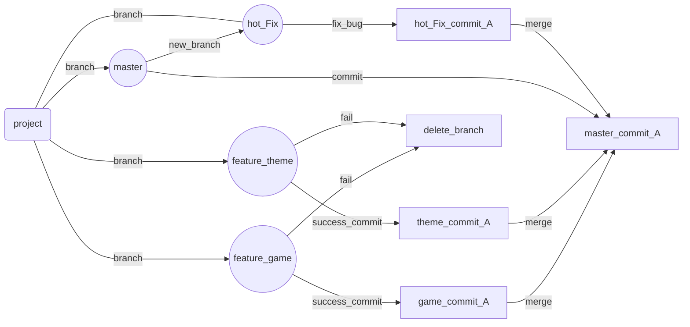

# 📄 Git快速入门

> Git分为3个区,工作区,暂存区,本地库
>
> 💿 资源
>
> 其他资料（简洁）：https://www.yiibai.com/git
>
> 其他资料（较复杂）：https://www.liaoxuefeng.com/wiki/896043488029600
>
> Git快速入门：https://www.bilibili.com/video/av17183591?from=search&seid=5626772541729191161
>
> Git进阶：https://www.bilibili.com/video/av24441039/
>
> 更新时间：2020-05-08 14:37:41


# ⚙️ 安装

> 1. 官网下载：https://git-scm.com/
> 2. 安装：next()
> 3. 配置基本信息
>
> ```bash
> git config --global user.name "Your Name"
> git config --global user.email "email@example.com"
> 
> # example
> git config --global user.name "SunSeekerX"
> git config --global user.email "1647800606@qq.com"
> ```


# 🔨 常用指令

|                         指令                          |                             说明                             |
| :---------------------------------------------------: | :----------------------------------------------------------: |
|                      **初始化**                       |                                                              |
|                       git init                        |         把本地的目录变成git本地仓库（执行一次即可）          |
|     git remote add [远程地址别名] [远程仓库地址]      |     将你本地仓库与远程仓库关联起来(一般关联一个地址即可)     |
|                                                       |                                                              |
|                     **常用操作**                      |                                                              |
|                      git status                       |                     查看本地仓库文件状态                     |
|                      git add -A                       |           添加整个工作区所有发生改变的文件到暂存区           |
|            git commit -m 'Commit message'             |  将暂存区文件放到本地仓库，`-m`后面接注释写上本次更改的地方  |
|        git pull [远程地址别名] [远程仓库分支]         |           合并远程仓库的更新（push之前必须先合并）           |
|       git push -u [远程地址别名] [远程仓库分支]       | 将本地当前分支的commit推送到远程指定分支，（`-u`指定该远程地址为默认，后面就可以不加任何参数使用git push了） |
|                                                       |                                                              |
|                   **创建`ssh key`**                   |                                                              |
| ssh-keygen -t rsa -b 4096 -C "your_email@example.com" | 创建一个`ssh key`，直接回车，文件存在，不用的直接删除目录，有用的就直接复制`ssh key` |
|               clip < ~/.ssh/id_rsa.pub                |                       把密钥放在剪贴板                       |


# 💻 Git命令行操作

## 📁 本地库操作

### 🔨 基本操作

> 基本操作命令

##### 0️⃣ 初始化

```shell
git init
# Initialized empty Git repository in C:/Users/SunSeekerX/Desktop/git/.git/
```

##### 1️⃣ 状态查看

```shell
git status
# 查看工作区，暂存区的状态
```

##### 2️⃣ 添加文件到暂存区

```shell
git add [file name]
git add . # 添加所有发生改变的文件 （操作的对象是当前目录下的所有变更，. 表示当前目录。）
git add -A # 添加所有发生改变的文件（操作的对象是整个工作区的所有变更，无论当前位于那个目录下。）
git add -u # 添加所有发生改变的文件（操作的对象是正个工作区已经跟踪的变更，无论当前位于那个目录下。）

```

##### 3️⃣ 移除暂存区文件

```shell
git rm --cached [file name]
```

##### 4️⃣ 暂存区提交到本地库

```shell
git commit -m 'commit message'
```

##### 5️⃣ 查看提交记录

```shell
git log
# 打印详细的日志信息
# (HEAD -> master) HEAD为指针指向当前版本
# 1.多屏控制
# 1.1:格向下翻页
# 1.2:向上翻页
# 1.3:退出
git log --pretty=oneline
# 以一行显示commit信息，提交的hash值完全显示，（无法显示回退版本之前的commit版本信息）
git log --oneline
# 以一行显示commit信息，提交的hash值只显示一部分，（无法显示回退版本之前的commit版本信息）
git reflog
# 以一行显示commit信息，并且显示出HEAD指针需要移动的步数，（可以显示回退版本之前的commit版本信息）
# 前面7个字符显示hash
# HEAD@{1}: 大括号内显示需要移动的步数
```

##### 6️⃣ 版本前进后退

```shell
# 本质：移动HEAD指针到某个指定的commit版本上

### 基于索引值[推荐]
git reset --hard [hash]

### 使用^符号：只能后退
git reset --hard HEAD^
# 一个^回退一步，n个后退n步

### 使用~符号：只能后退
git reset --hard HEAD~n
# 表示回退n步


####### reset 参数解释
--soft 
# 1仅在本地库移动HEAD指针
--mixed 
# 1.会在本地库移动HEAD指针
# 2.重置缓存区
--hard
# 1.会在本地库移动HEAD指针
# 2.重置缓存区
# 3.重置工作区
```

##### 7️⃣ 比较文件差异

```shell
git diff
# 比较所有文件，工作区的文件和暂存区进行比较
git diff [文件名]
# 将工作区的文件和暂存区进行比较
git diff [本地库中的历史版本] [文件名]
# 将工作区的文件和本地库中的历史记录版本进行比较

```


#### 🔨 分支管理

##### 说明

简介：在版本控制过程中，使用多条线同时推进多个任务。

好处：各个分支在开发的过程中，如果某一个分支开发失败，不会对其他分支造成任何影响，删除重新开始即可。

> 初始化git仓库默认创建一个`master`分支
>
> 其他分支习惯以`feature_[name]`命名
>
> 主分支有bug去修复，习惯开分支为`hot_fix`进行修复，修复完`pull-request`到`master`分支
>
> > 因为主分支一般24小时不间断运行





##### 0️⃣ 查看当前所有分支

```shell
git branch -v
```

##### 1️⃣ 创建新的分支

```shell
git branch [分支名]
```

##### 2️⃣ 切换分支

```shell
git checkout [分支名]
```

##### 3️⃣ 合并分支

```shell
# 1.切换到接受修改的分支上（被合并，增加新内容）
git checkout [分支名]
# 2.合并分支
git merge [有新内容的分支]
```

##### 4️⃣ 解决冲突

```shell
# 找到冲突的文件解决冲突
# 添加解决修改的文件
# commit
```


## 📡 远程库操作

> 如果是本地初始的仓库需要添加远程仓库地址，克隆仓库不需要。
>
> 可以使用http或者ssh方式
>
> http需要账户名和密码,ssh需要配置ssh-key


### 🔨 基本操作-本地初始仓库

##### 0️⃣ 查看当前仓库远程地址

```shell
git remote -v
```

##### 1️⃣ 添加远程仓库地址

```shell
git remote add origin [远程地址]
```

##### 2️⃣ 合并远程仓库代码

```shell
git pull [远程地址别名（origin）] [远程仓库分支]
# 相当于 fetch + merge

# 如果出现 fatal: refusing to merge unrelated histories
# 其实这个问题是因为 两个 根本不相干的 git 库， 一个是本地库， 一个是远端库， 然后本地要去推送到远端， 远# 端觉得这个本地库跟自己不相干， 所以告知无法合并
# 具体的方法， 一个种方法： 是 从远端库拉下来代码 ， 本地要加入的代码放到远端库下载到本地的库， 然后提交上# 去 ， 因为这样的话， 你基于的库就是远端的库， 这是一次update了
# 第二种方法：
# 使用这个强制的方法
git pull origin master --allow-unrelated-histories 
#  把两段不相干的 分支进行强行合并
```

##### 3️⃣ 推送代码

```shell
git push [远程地址别名（origin）] [远程仓库分支]
```

##### 4️⃣ 抓取仓库内容

```shell
git fetch [远程地址别名（origin）] [远程仓库分支]
```

##### 5️⃣ 切换到抓取分支上

```shell
git checkout [远程地址别名（origin）]/[远程仓库分支]
```

##### 6️⃣ 合并远程抓取的内容

```shell
git merge [远程地址别名（origin）]/[远程仓库分支]
```


### 🔨 基本操作-克隆远程仓库

> 其他操作同`基本操作-本地初始仓库`

##### 0️⃣ 克隆远程仓库

```shell
git clone [远程仓库地址]
```


### 🔨 其他操作

##### 0️⃣ 查看当前项目配置文件

```shell
git config --local -l
```

##### 1️⃣ 查看当前项目配置文件并编辑

```shell
git config --local -e 
# 等同于
git config -e 
#[remote "origin"]
#       url = https://gitee.com/SunSeekerX/test.git
#       fetch = +refs/heads/*:refs/remotes/origin/*
# 此处配置了远程地址`origin`的地址和抓取信息
# [branch "master"]
#       remote = origin
#       merge = refs/heads/master
# 此处配置了默认pull和push的远程地址和合并分支名
```

##### 2️⃣ 撤销本地工作区当前所有更改

```shell
git checkout -- .
```


### ❗️ 注意

##### 0️⃣ win10切换账户

> 在win10上使用http方式，win10会记录用户名和密码，需要切换账户需要到
>
> `控制面板\所有控制面板项\凭据管理器`中找到自己的账户名和密码进行删除，然后就能重新输入用户名和密码

##### 1️⃣ 设置ssh-key

> 百度`Git 配置ssh key`


#### Fork and pull request

> 略
