## Vue项目自动化构建

`Jenkins`安装查看`Docker`章节。

`Jenkins`第一次安装完成最好重启一下，因为如果安装了语言包有些地方还是英文的。应该是个bug。


## 前提

- `Vue`项目+`Git`
- 有`Jenkins`环境
- 有部署项目的服务器
- 域名
- Linux知识


## 目标

在本地写好代码，一旦提交到`Git`，通过`web-hook`，触发`Jenkins`的自动构建任务，`Jenkins`自动从`Git`上面拉取代码>安装依赖>打包>发送到部署的服务器等一系列操作。

> 简单来说，我本地写好代码，我提交到`Git`之后，就有个东西帮我打包发送到服务器。我不需要管这些事，我只要写代码、测试、推代码就完事了。

目前需要实现的就是这样的功能，但`Jenkins`能做的不只是这么多。不过对于我目前的项目来说足够了。


## 实现

### 0x1 安装ssh发送插件 - `Publish Over SSH`

> 见名知意，通过`ssh`发布，用来将打包好的项目用`ssh`连接的方式发送到部署的服务器，并且执行其他的命令。

1. 选择系统管理
2. 选择插件管理
3. 页面直接`ctrl+f`搜索`ssh`，直接安装`Publish Over SSH`插件(不要用自带的过滤搜索没用)


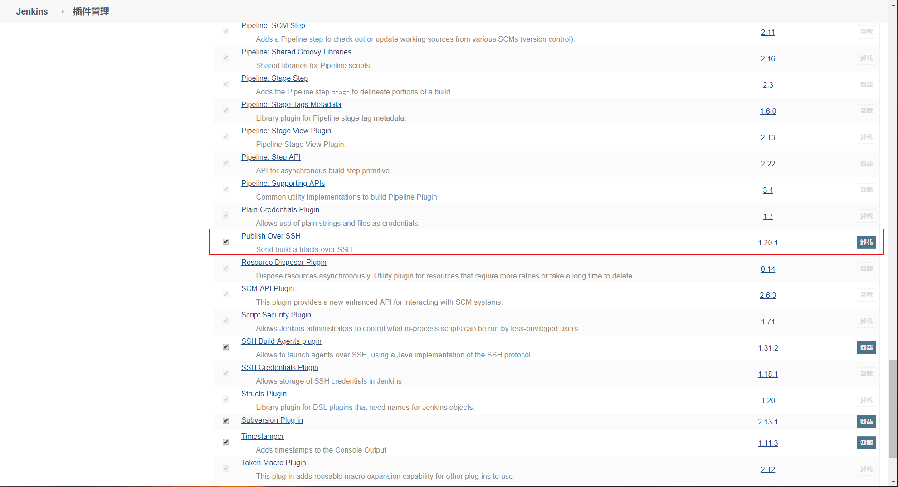


### 0x2 配置`ssh`插件 

> 这里要配置的部署网站的服务器，我采用的方式是密码登录，也可以配置密钥文件登录的。看你的喜好。

1. 选择系统管理
2. 选择系统配置
3. 拉到最后面找到`Publish over SSH`
4. 新增`SSH - Server`
5. `name`标识该服务器的
6. `Hostname`服务器的`IP`
7. `Username`填写服务器的用户
8. 点开高级设置
9. 勾选`Use password authentication, or use a different key`
10. `Passphrase`填写密码
11. 填写完了点击`Test Configuration`测试下是否连接成功

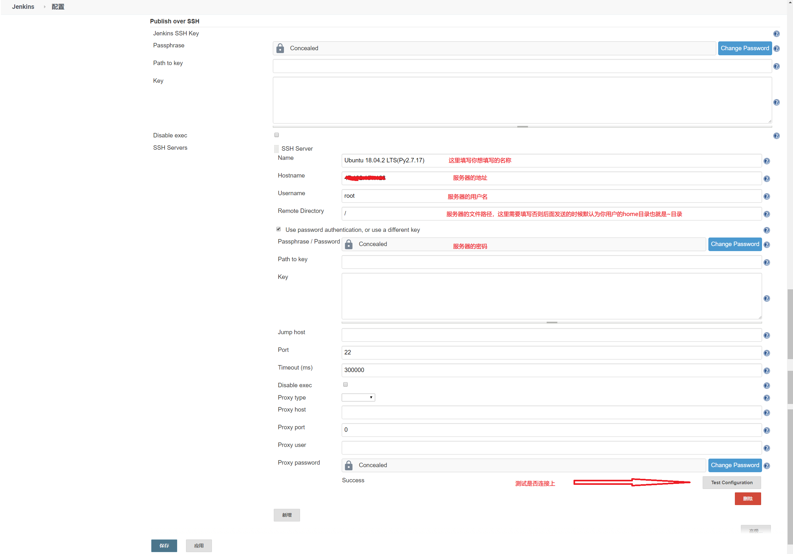


### 0x3 安装`nodejs`插件

1. 安装`nodejs`插件（`Jenkins`目前好像无法使用外部的`nodejs`）

   > 这个插件用来打包vue项目，跟我们自己本地执行`yarn build`等命令无区别。

   1. 选择系统管理
   2. 选择插件管理
   3. 页面直接`ctrl+f`搜索`nodejs`，直接安装`nodejs`插件(不要用自带的过滤搜索没用)
   4. 安装完成
   5. 选择系统管理
   6. 选择全局工具配置
   7. 选择新增 NodeJS
      1. 别名`node 12.16.3`
      2. 勾选自动安装
      3. 版本选择`12.16.3`，这是目前稳定的长期支持版本
      4. 保存
   
   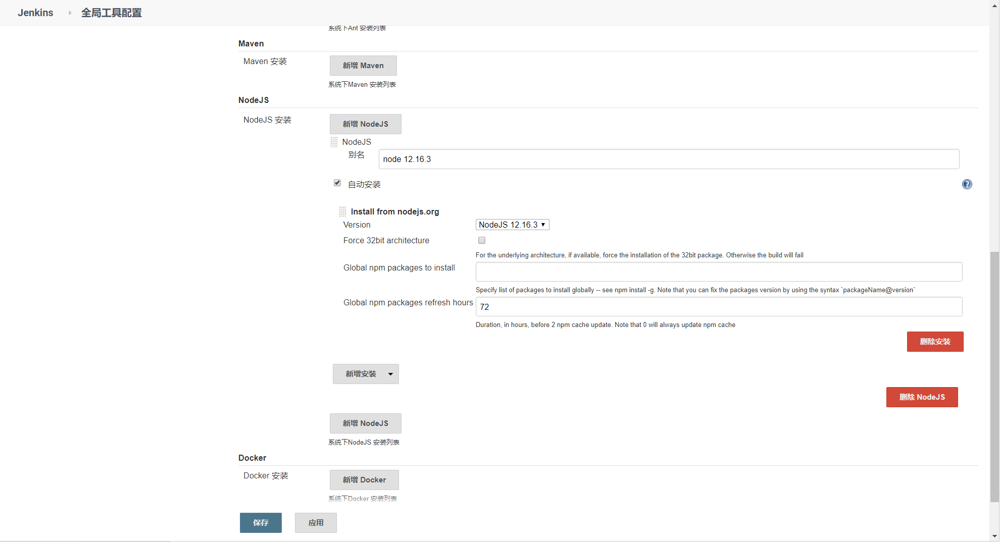


## 新建项目配置

### 0x1 `新建项目` - `选择自由风格项目`

### 0x2 输入名称

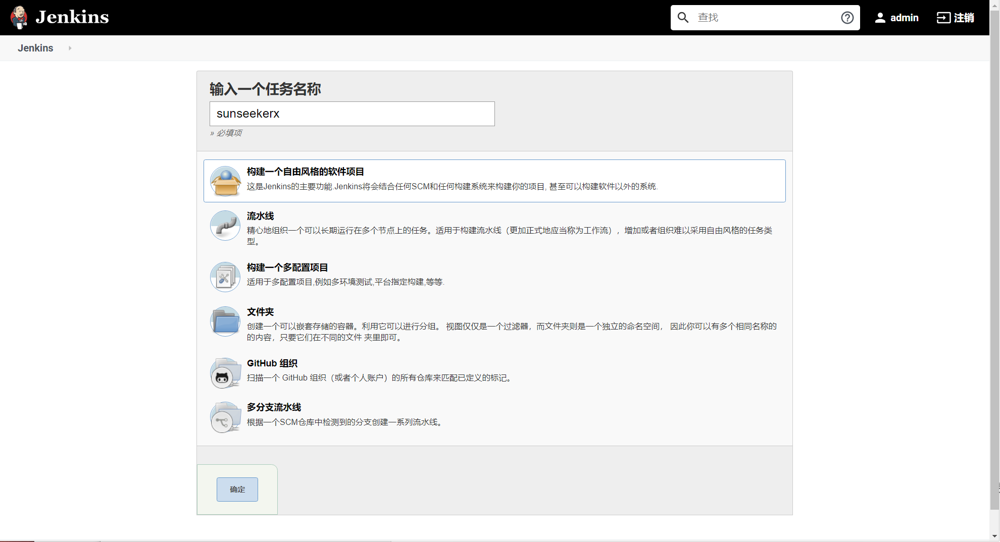


### 0x3 源码管理选择你的项目的`Git`

> 我的文档项目访问是公开的，可以直接访问，如果是私有项目还需要配置一个可访问的账号才可以。就是下面`Credentials`选项。

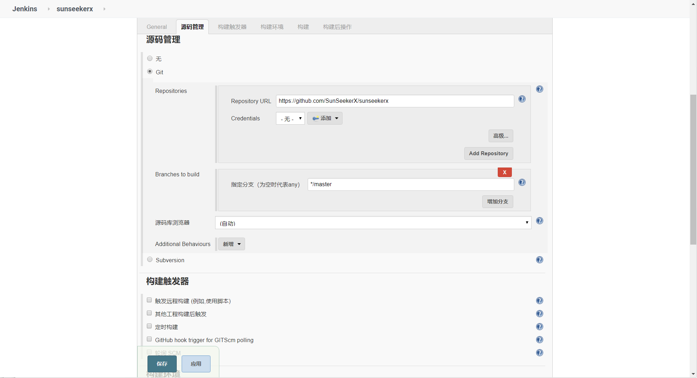


### 0x4 构建触发器

> 勾选`GitHub hook trigger for GITScm polling`，这是一旦我们推送代码就会触发构建。

### 0x5 构建环境

> 勾选`Provide Node & npm bin/ folder to PATH`，这是提供`Node`命令给我们使用。

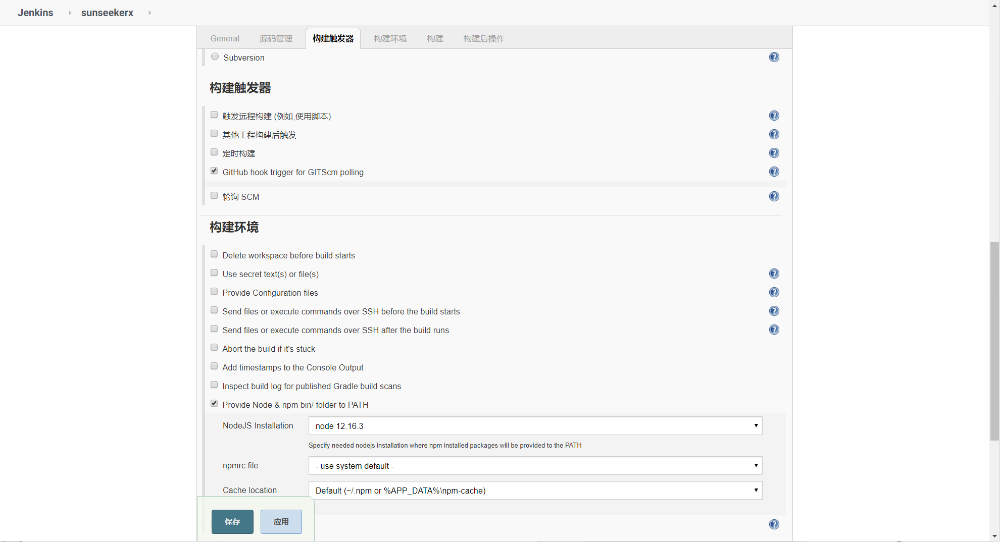


### 0x6 增加构建步骤 - `执行shell`

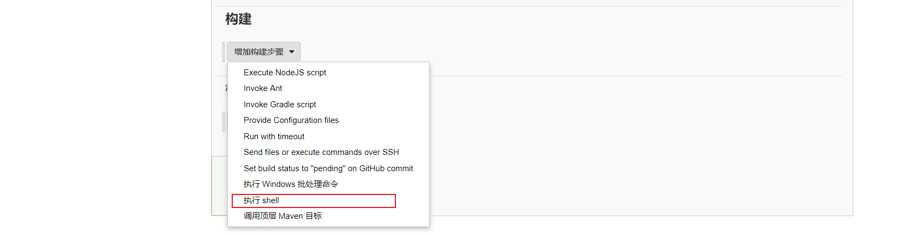


执行shell内容

> 由于内部的`node`环境和外部隔离，所以我们第一次使用的时候需要安装`yarn`和设置一些国内源。
>
> 这一步我们进行安装依赖和打包项目，并且将打包的项目压缩等待后续发送到部署的服务器上。

```bash
# 进入Jenkins工作空间下hxkj项目目录
cd /var/jenkins_home/workspace/sunseekerx

# 下面的命令只需要执行一次，后续可以删除
###
# npm切换为淘宝源
npm config set registry http://registry.npm.taobao.org/
# 安装yarn
npm i yarn -g
# yarn切换为淘宝源
yarn config set registry https://registry.npm.taobao.org
###

# 安装项目中的依赖
yarn
# 打包
yarn build
# 进入生成打包文件的目录
cd docs/.vuepress/dist
# 把生成的项目打包成压缩包，方便移动到项目部署目录
tar -zcvf sunseekerx.tar.gz * 
```

执行完成之后会在服务器生成`sunseekerx.tar.gz`，下一步就是把这个文件发送到指定部署的服务器。进行解压。

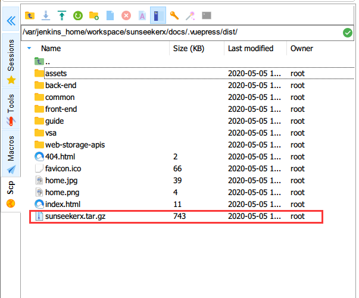


### 0x7 增加构建后的步骤

> 这一步将上一步打包好的文件发送到服务器，并且解压。

```bash
cd /www/wwwroot/sunseekerx.yoouu.cn
\echo ">>>当前工作路径："`pwd`
\shopt -s extglob
\echo ">>>删除：(.htaccess|.user.ini|sunseekerx.tar.gz)之外的文件"
\rm -rf !(.htaccess|.user.ini|sunseekerx.tar.gz)
\echo ">>>解压：sunseekerx.tar.gz"
\tar -zxvf sunseekerx.tar.gz -C ./
\echo ">>>移除：sunseekerx.tar.gz"
\rm -rf sunseekerx.tar.gz
\echo ">>>执行成功"
```

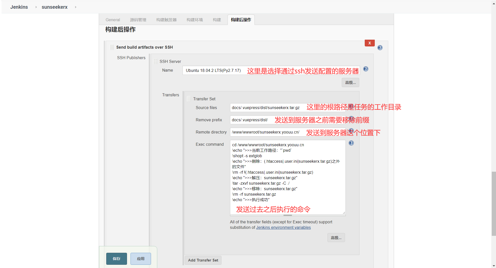


### 0x8 测试构建

> 可以看到服务器有了构建之后的文件

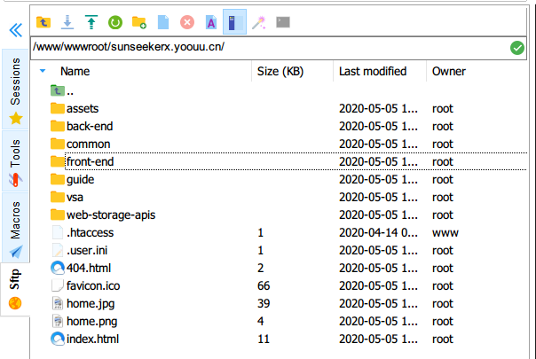


### 0x9 访问下网站试试，nice😁

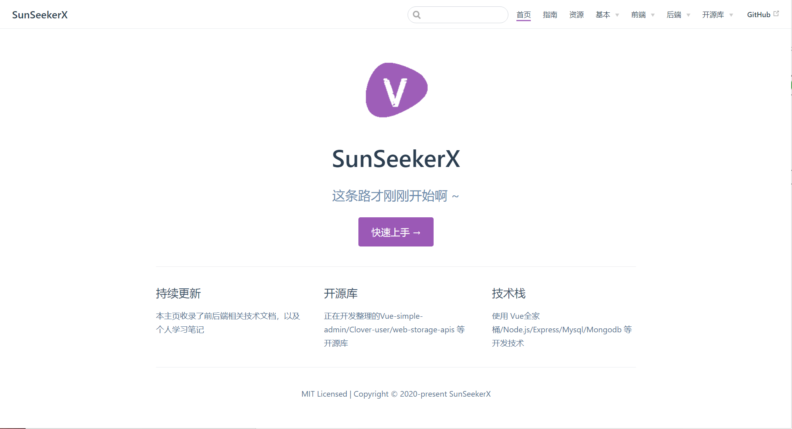


### 0x10 Git设置`Webhooks`

前提是`Git`需要能访问到你的`Jenkins`，一旦有代码提交上来，`Git`就会去请求你这个地址，然后`Jenkins`触发构建动作。

> 简单来说就是我提交代码告诉`Git`，`Git`告诉`Jenkins`你该构建了，完了`Jenkins`去构建。`Git`就像仓库管理员，`Jenkins`就是干苦力的。😁

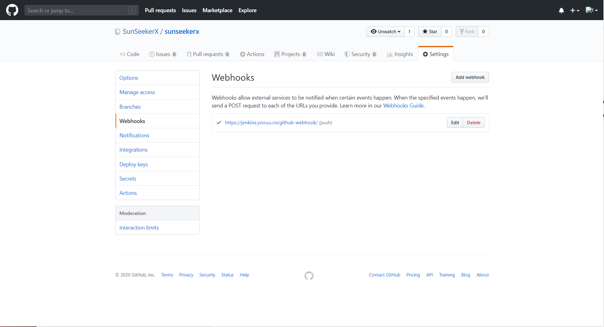

### 0x10 测试下提交构建

在本地修改一些文件，提交上去，稍等一会儿查看`Jenkins`，这个处于等待中的任务就是提交的任务

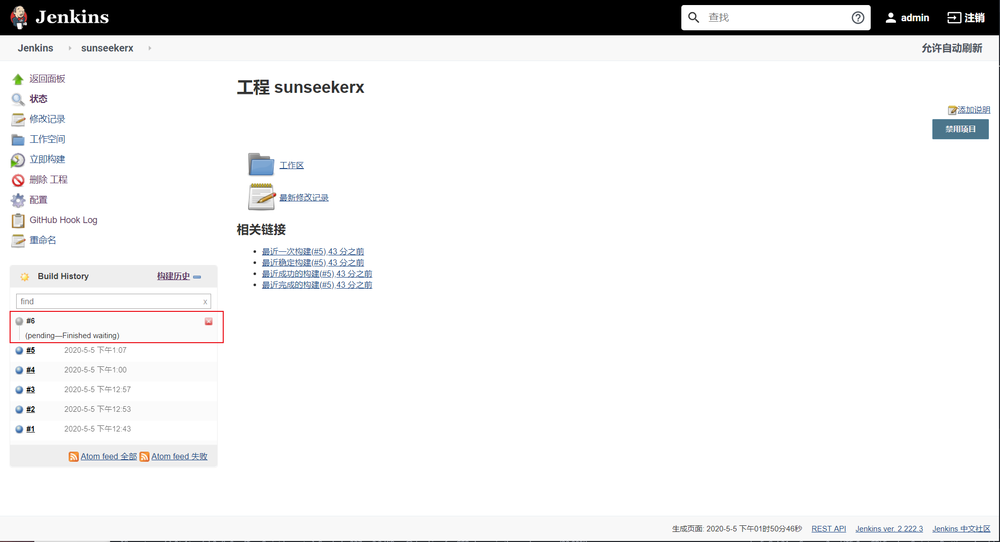


访问[https://sunseekerx.yoouu.cn/](https://sunseekerx.yoouu.cn/)试试，更新成功🤣

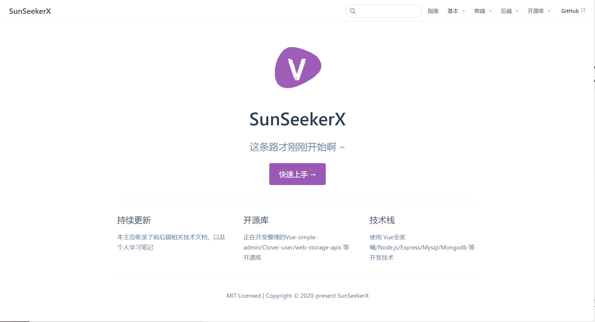

