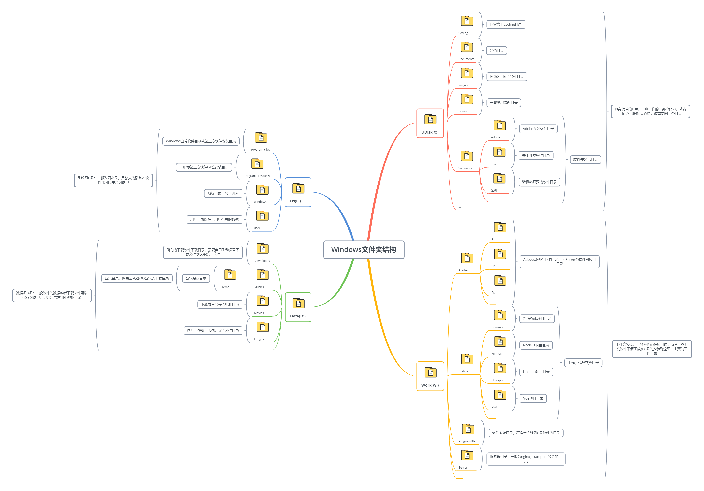
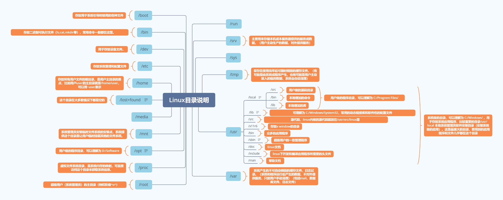

## Xmind

### Windows文件夹结构




### Linux目录




## Windows 💻 

## 1.微软拼音输入自定义时间

Windows 10：`设置`→`时间和语言`→`语言`→`中文(中华人民共和国)`→`选项`→`微软拼音`→`选项`→`词库和自学习`→`添加新的或编辑现有的用户自定义短语`→`添加`。

然后在短语里面输入以下代码：

```
%yyyy%-%MM%-%dd% %HH%:%mm%:%ss% +0800
```

> 然后拼音输入法状态下输入你定义的名字：例如我的为`utc`，输入`utc`回车就是显示当前时间


## 2.查看端口占用

### 查看被占用端口对应的PID

```powershell
netstat -aon|findstr "49157"
```

### 查看是哪个进程或者程序占用了`2720`端口

```powershell
tasklist|findstr "2720"
```


输入tasklist|findstr "2720"


## Something

我喜欢学习新的东西，但我宁愿学习一些真正新的东西，而不仅仅是另一种完成同样任务的方法。


Dart 语言本来已经死掉了，就是因为 Flutter 这个非常有前景的业务绑定了它，所以又活过来了。说到底，还是业务重要。好的技术不一定能活，坏的技术不一定会死，取决于有没有业务。


## 信息的半衰期

半衰期是一个物理学概念，指的是放射性物质减少一半质量（辐射衰弱）所需的时间。

这个概念其实很好理解。根据爱因斯坦最著名的质能公式 E=mc²，能量即质量，任何释放能量的物体都必然会减轻质量。


最近，我看到[有人](https://www.remote.tools/newsletter/knowledge-decay-and-half-life-of-information)提出了一个新的概念，他说信息也有半衰期。 **信息的半衰期指的是，一半的信息量变得无关紧要或者彻底过时所需的时间。**

以报纸为例，出版当天的价值最大，第二天再看，价值至少减半，所以报纸的半衰期是一天到几天。微信和微博的半衰期也类似，早上发的朋友圈，晚上就不太有人看了。至于即时消息或聊天的半衰期就更短了，只有几个小时。

当代社会的趋势是，信息的半衰期越来越短，有一个词叫做"快餐文化"。以前，一本新书可以在书店里卖几年，现在卖几个月就下架了，被新的出版物取代。大部分书籍的半衰期就是几个月到一年。


如果你写过软件文档，就会对半衰期有切身的体会。一旦软件版本升级，以前文档的价值立刻大减。我为 React 0.14 版写过教程，短短几年中，它的 API 至少变了三次，每变一次，原始教程的价值就降低一半。一算就知道，经过三轮半衰期，文档的价值只剩下八分之一。

**我的建议是，不管你写什么，尽量写一些半衰期比较长的内容** ，这样有利于提高内容的使用价值（也是提高你的劳动的价值）。有些朋友喜欢发朋友圈和社交媒体，花了很多时间，但是内容马上就过时了，也没法重复使用。

顺便说一句，这个周刊的半衰期就很短，过了一周就很少有人看了。我也在想，怎样才能延长周刊的半衰期，使得它有更多被用到的机会。

> 来源：科技爱好者周刊：第 103 期：[http://www.ruanyifeng.com/blog/2020/04/weekly-issue-103.html](http://www.ruanyifeng.com/blog/2020/04/weekly-issue-103.html)


## `Typora`快捷键

- 无序列表：输入-之后输入空格
- 有序列表：输入数字+“.”之后输入空格
- 任务列表：-[空格]空格 文字
- 标题：ctrl+数字
- 表格：ctrl+t
- 生成目录：[TOC]按回车
- 选中一整行：ctrl+l
- 选中单词：ctrl+d
- 选中相同格式的文字：ctrl+e
- 跳转到文章开头：ctrl+home
- 跳转到文章结尾：ctrl+end
- 搜索：ctrl+f
- 替换：ctrl+h
- 引用：输入>之后输入空格
- 代码块：ctrl+alt+f
- 加粗：ctrl+b
- 倾斜：ctrl+i
- 下划线：ctrl+u
- 删除线：alt+shift+5
- 插入图片：直接拖动到指定位置即可或者ctrl+shift+i
- 插入链接：ctrl+k
- 分割线：
  - `***`+回车
  - `---`+回车  