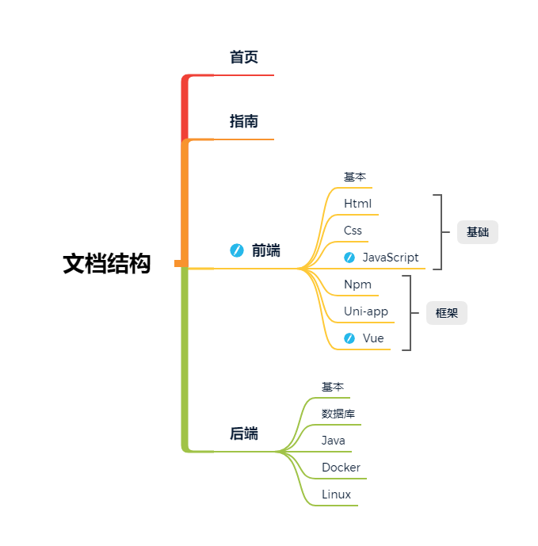

## 简介

这是个人的在线笔记，因为不喜欢用客户端的方式记录笔记，之前的记录方式一直是在电脑用`typora`写好，存在U盘，需要用的时候插上U盘就能用了，`typora`写笔记是真的舒服，不过这种方式也有缺点，U盘掉了就GG，U盘也有使用年限。

随即发现`Vuepress`，存`Git`，在线。方便传播和拷贝。除了一些带有密码的笔记之外，其他的基本都是公开的。

相关的东西会持续更新和补充。

## 文档结构

