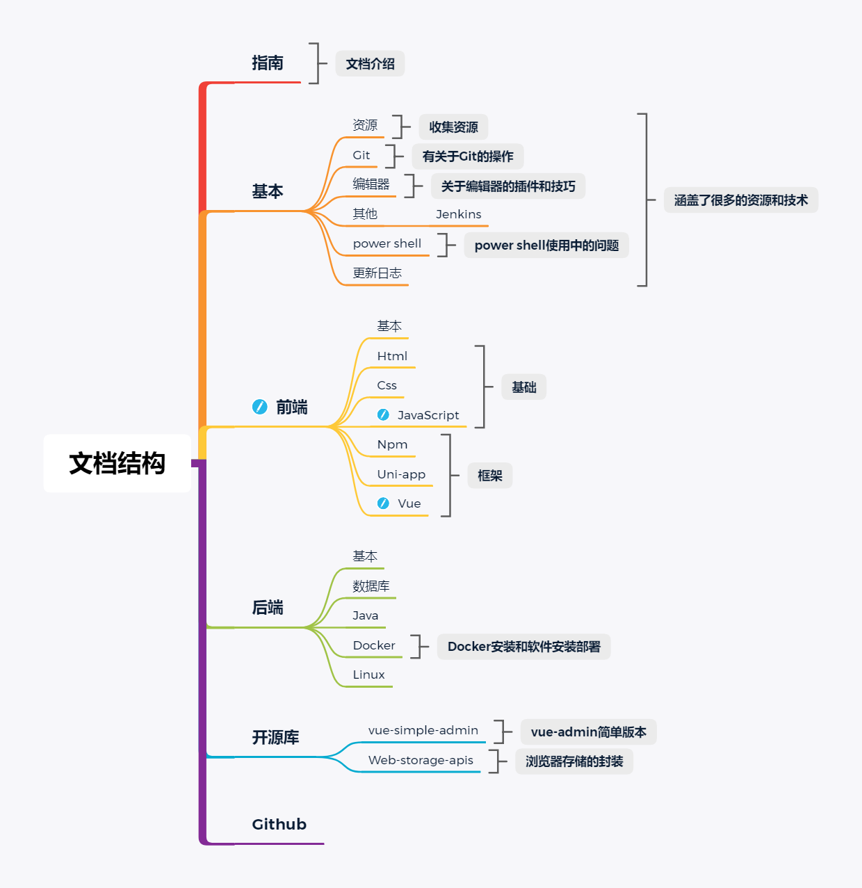

## 简介

这是个人的在线笔记，因为不喜欢用客户端的方式记录笔记，之前的记录方式一直是在电脑用`typora`写好，存在U盘，需要用的时候插上U盘就能用了，`typora`写笔记是真的舒服，不过这种方式也有缺点，U盘掉了就GG，U盘也有使用年限。

随即发现`Vuepress`，存`Git`，在线。方便传播和拷贝。除了一些带有密码的笔记之外，其他的基本都是公开的。

相关的东西会持续更新和补充。

## 文档结构

## Todo 2020

🧐：进行中	❌：放弃	✅：完成

1. [🧐] 抽离简单的用户登录注册模型，实现一个类似于微服务的用户模块，包含登录注册、token 鉴权、其他应用接入、管理查看统计系统用户、前端`vue`+`element`，后端`nestjs`的系统
2. [🧐] 实现一个持续维护的后台管理系统template ，作为以后后台管理开发快速接入业务的脚手架（vue+element）
3. 实现一个`uni-app`移动端脚手架，为以后开发应用做准备
4. 实现一个`express`构建`restful api`的脚手架
5. 实现一个`nestjs`的`restful api`的脚手架
6. 染指`Golang`（之前想系统学习下`java`，大学里学的是`java`，无奈当时没有很深入，不过貌似有更好的选择）
7. [🧐] 学习Vue3快速深入全攻略（优惠购买的）:[https://ke.qq.com/course/1967929](https://ke.qq.com/course/1967929)
8. [🧐] 文档持续更新
9. [🧐] 研究下[Branca](https://branca.io),一种安全令牌的数据格式，比 JWT 更安全，同类项目还有 [Paseto](https://paseto.io/)。
10. 书籍：[斯诺登自传](https://a.temporaryrecord.com/)《永久记录》，未删节的简体中文版 PDF 下载，作者本人授权。

## 联系

> 需要帮助、技术支持、对文档中有疑问，
>
> 可以通过以下方式联系我。（提供技术支持需要付费！）
>
> 基本全天在线。

Email：1647800606@qq.com

QQ：1647800606

